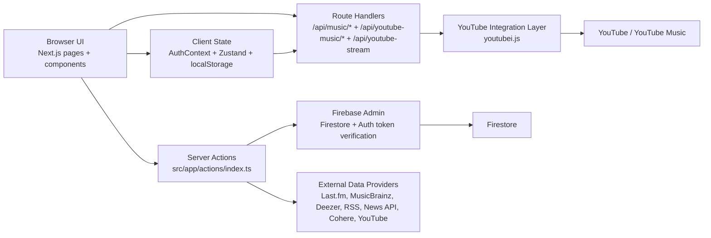

# SongDB Architecture

Last synchronized: March 11, 2026

## System Overview

SongDB is a hybrid music discovery and playback application built on Next.js. The current product combines:

- a mixed streaming UI where landing discovery shelves are server-rendered and cached, while playback-heavy surfaces remain client-driven
- server-rendered detail pages for songs, artists, and ranked content
- Firebase Authentication for identity
- Firestore for community data such as reviews and favorites
- external music data providers for catalog, metadata, art, news, and AI summaries
- YouTube and YouTube Music integrations for search, recommendations, and audio streaming

The important architectural truth today is that SongDB does not yet run from a fully normalized internal catalog. Most catalog data is fetched on demand from external providers, while Firestore currently persists user-generated and user-specific data.

## High Level Architecture



## Frontend Architecture

### App Shell

`src/app/layout.tsx` owns the global shell. It wraps all routes with:

- `AuthProvider` for Firebase auth session state
- `Sidebar` and `TopNav` for persistent navigation
- `SplashScreen` for entry transition
- `LibraryStoreHydrator` for client-only hydration of local library state after the first SSR pass
- `YoutubePlayer` for the global playback surface
- `ServiceWorkerRegistration` for PWA bootstrap

This means playback, navigation, and auth state persist across route changes instead of being recreated per page.

### Rendering Strategy

SongDB uses a mixed rendering model:

- Cached server pages for discovery-first screens such as `src/app/page.tsx` and `src/app/explore/page.tsx`, with client islands for playback controls and local-library state
- Client pages for interaction-heavy screens such as `src/app/search/page.tsx`, `src/app/library/page.tsx`, and `src/app/profile/page.tsx`
- Async server pages for metadata-rich content views such as `src/app/song/[id]/page.tsx`, `src/app/artist/[id]/page.tsx`, and `src/app/top-rated/page.tsx`

The split is practical:

- client routes own rapid interaction, queue updates, optimistic UI, and media control
- server routes own expensive provider lookups, SEO-visible content, shared discovery caches, and protected data aggregation

### Client State Model

The frontend currently uses three distinct state systems:

| State Area | Module | Responsibility |
| --- | --- | --- |
| Auth session | `src/context/AuthContext.tsx` | subscribes to Firebase Auth, exposes current user, logout, and Google sign-in |
| Playback | `src/store/youtubePlayer.ts` | current track, queue, play-next insertion, history, structured lyrics, autoplay, up-next, volume, repeat, sleep timer, sound profile, bass boost, player visibility |
| Local library | `src/store/library.ts` | liked songs, recently played lists, and local playlists stored in `localStorage` |

`src/lib/player/audioEngine.ts` is the media bridge between Zustand and the browser `HTMLAudioElement`. The store decides what should play; the audio engine performs the actual playback, applies lightweight Web Audio filters for bass and presence shaping, and feeds progress, duration, and end-of-track events back into the store.

### Component Organization

- `src/components/shared/*` contains shell and cross-route components
- `src/components/home/*` contains homepage-specific premium landing sections
- `src/components/ui/*` contains reusable feature widgets such as cards, track rows, review modules, and rating breakdowns
- `src/components/player/*` contains player-specific UI

`HomeView` now combines three discovery layers:

- cached server-fed home shelves
- cached server-fed explore shelves
- a mixed "music flow" feed that rotates across genre, language, country, time, artist, and category lanes, then filters client-side like a short-form feed surface

Interactive components such as `FavoriteButton` and `ReviewSection` call server actions directly from the client, using Firebase ID tokens for privileged mutations.

## Backend Architecture

SongDB does not have a separate standalone API server. The backend is hosted inside the Next.js runtime and split across two delivery styles.

### 1. Route Handlers

Route handlers live under `src/app/api/*` and are used when the browser needs a fetch-based API.

Current groups:

- `/api/music/*`
  - thin wrappers around `src/lib/youtube/youtubeService.ts`
  - used by search and simple track info lookups
- `/api/youtube-music/*`
  - wrappers around `src/lib/youtube-stream.ts`
  - expose home shelves, explore shelves, artist/album/playlist data, lyrics, related items, suggestions, and up-next tracks
- `/api/youtube-stream`
  - resolves stream metadata and proxies the selected audio stream via direct YouTube extraction
  - supports `Range` headers so the browser can seek inside audio streams

### 2. Server Actions

`src/app/actions/index.ts` acts as the application service layer. It is responsible for:

- validating input with Zod
- rate limiting requests with an in-memory `LRUCache`
- verifying Firebase ID tokens for protected actions
- orchestrating external provider calls
- reading and writing Firestore documents via Firebase Admin

This is the only part of the current codebase that persists reviews and cloud favorites.

## Service Layers

| Layer | Purpose | Primary Modules |
| --- | --- | --- |
| Presentation layer | route layouts, pages, visual components, user interaction | `src/app`, `src/components` |
| Client state layer | auth session, playback state, local library persistence | `src/context/AuthContext.tsx`, `src/store/*`, `src/lib/player/audioEngine.ts` |
| Application layer | request validation, rate limiting, orchestration, mutation rules | `src/app/actions/index.ts`, `src/app/api/*` |
| Integration layer | external provider adapters and response normalization | `src/lib/lastfm.ts`, `src/lib/musicbrainz.ts`, `src/lib/newsapi.ts`, `src/lib/rss.ts`, `src/lib/cohere.ts`, `src/lib/youtube-stream.ts`, `src/lib/youtube/youtubeService.ts` |
| Infrastructure layer | Firebase initialization, request guards, cache helpers, utility helpers, environment-backed clients | `src/lib/firebase.ts`, `src/lib/firebase-admin.ts`, `src/lib/request-guard.ts`, `src/lib/utils.ts`, `src/lib/youtube-feed.ts` |
| Persistence layer | Firestore collections for reviews and favorites, Firebase Auth identities | Firebase Auth, Firestore |

## API Flow

### Flow A: Home and Explore Shelves

1. `src/app/page.tsx` and `src/app/explore/page.tsx` load shelf data on the server through `src/lib/youtube-feed.ts`.
2. `src/lib/youtube-feed.ts` wraps curated YouTube Music shelf loaders in `unstable_cache` so repeated visits reuse shared results.
3. `youtubei.js` searches YouTube/YouTube Music using curated category queries via `src/lib/youtube-stream.ts`.
4. Results are normalized into shelf objects and rendered immediately in the first HTML response.
5. Client components such as `HomeView`, `MusicShelf`, and `MusicCard` handle playback actions after hydration.
6. After the first client mount, local library state is hydrated from `localStorage`, allowing the home hero and quick picks to personalize against recent listening, artist affinity, and time-of-day without causing SSR hydration mismatches.
7. The home page also renders a mixed flow feed that rotates through genre, language, country, artist, category, and time-based queries, then lets the client filter and queue that feed like a continuous music stream.

### Flow B: Search

1. The search page updates the query string and calls `/api/music/search?q=...`.
2. `src/lib/youtube/youtubeService.ts` uses `youtubei.js` to search videos.
3. The route returns normalized track data.
4. The page renders `TrackRow` results.
5. When the user plays a track, the player store requests `/api/youtube-stream?id=...`.

### Flow C: Playback, Lyrics, and Up Next

1. `useYouTubePlayerStore.playTrack()` sets the current track and queue state.
2. The store asks `audioEngine` to play `/api/youtube-stream?id=<videoId>`.
3. The route handler resolves track metadata to score available formats, prefers the best playable audio-only stream, and returns a partial-content capable response.
4. In parallel, the store fetches `/api/youtube-music/lyrics` and `/api/youtube-music/up-next`.
5. The lyrics route returns caption-derived synced lyric lines when available, and falls back to duration-based estimated timings for official plain lyrics when needed.
6. The player UI updates as audio events push progress and duration changes back into Zustand, and the active lyric line follows playback when synced data is available.
7. User-triggered queue actions such as play next, add to queue, add to playlist, and sleep timer changes are handled entirely in client state so route changes do not interrupt playback.

### Flow E: Public API Hardening

1. Public route handlers under `src/app/api/youtube-*` validate incoming query params with Zod.
2. `src/lib/request-guard.ts` applies in-memory request throttling keyed by forwarded IP plus user agent.
3. Sensitive server-only modules such as `src/lib/firebase-admin.ts`, `src/lib/lastfm.ts`, and `src/lib/youtube.ts` are marked with `server-only` so they cannot be pulled into client bundles accidentally.
4. `next.config.ts` applies global response headers including CSP, HSTS, framing restrictions, and stricter cross-origin policies.

### Flow D: Favorites and Reviews

1. Client components obtain the Firebase ID token from the current user.
2. The component calls a server action such as `addFavoriteAction()` or `createReviewAction()`.
3. The server action verifies the token with Firebase Admin.
4. The action validates the payload with Zod, applies rate limiting, and writes to Firestore.
5. Firestore documents are returned to the client for optimistic or immediate UI refresh.

## Database Interaction

### Current Data Ownership

| Data Type | Source of Truth | Access Path |
| --- | --- | --- |
| Auth identity | Firebase Auth | client SDK for sign-in, Admin SDK for token verification |
| Reviews | Firestore `reviews` collection | server actions only |
| Cloud favorites | Firestore `favorites` collection | server actions only |
| Local liked songs | browser `localStorage` | Zustand `useLibraryStore` |
| Local recent history | browser `localStorage` | Zustand `useLibraryStore` |
| Local playlists | browser `localStorage` | Zustand `useLibraryStore` |
| Local playback preferences | browser `localStorage` | Zustand `useYouTubePlayerStore` |
| Catalog metadata | external providers at request time | server actions and route handlers |

### Important Interaction Notes

- Firestore is currently used as a community and profile data store, not yet as the canonical music catalog.
- The codebase already contains Firestore rules for `songs`, `artists`, `albums`, and `users`, but those collections are not actively populated by application code today.
- Review and favorite documents are intentionally denormalized so pages can render without joining against a local catalog.
- Local library state and cloud favorites are separate systems today. That is functional, but it should be unified later to avoid user confusion.

## Folder Structure

```text
songdb/
├── ARCHITECTURE.md
├── DB_SCHEMA.md
├── TASKS.md
├── API_CONTRACT.md
├── firestore.rules
├── public/
│   ├── icons/
│   ├── manifest.json
│   └── sw.js
├── scripts/
│   ├── diagnose.cjs
│   ├── diagnose.ts
│   └── test-stream.ts
├── src/
│   ├── app/
│   │   ├── actions/
│   │   ├── api/
│   │   ├── auth/
│   │   ├── album/
│   │   ├── artist/
│   │   ├── library/
│   │   ├── playlist/
│   │   ├── profile/
│   │   ├── search/
│   │   └── song/
│   ├── components/
│   │   ├── home/
│   │   ├── player/
│   │   ├── shared/
│   │   └── ui/
│   ├── context/
│   ├── hooks/
│   ├── lib/
│   │   ├── player/
│   │   ├── youtube-feed.ts
│   │   └── youtube/
│   ├── schemas/
│   └── store/
├── package.json
└── .env.example
```

## How The Components Interact

- The layout mounts shared UI once, so the player and navigation survive route transitions.
- Client pages fetch data from route handlers when they need low-latency interactive updates.
- Server pages call server actions directly when they need provider-backed content before render.
- UI controls that mutate user data use Firebase ID tokens and server actions, never direct Firestore writes from the browser.
- The playback store is the center of the listening experience. It drives the audio engine, player UI, lyrics requests, queueing, and up-next fetches.
- External providers supply most music metadata today, while Firestore stores the social layer around that metadata.

## Documentation Maintenance Rule

Whenever the app moves catalog data into Firestore, adds new persisted entities, changes route responsibilities, or merges local and cloud library behavior, update this document together with `DB_SCHEMA.md` and `TASKS.md`.
