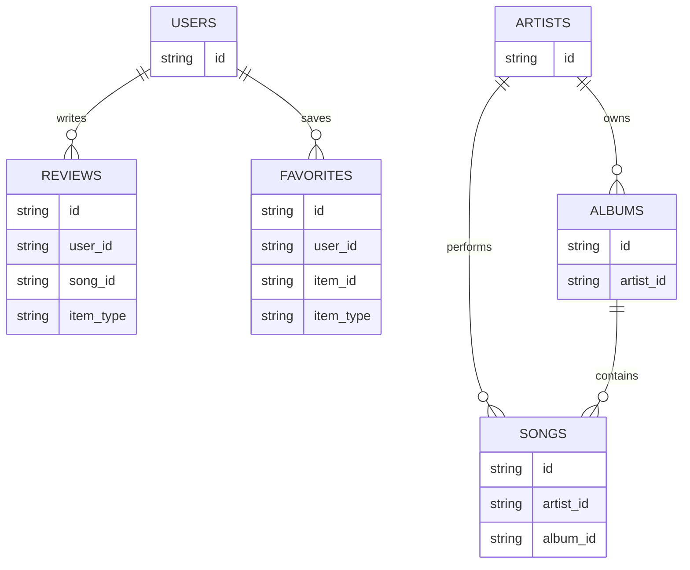

# SongDB Database Schema

Last synchronized: March 11, 2026

## Scope

SongDB uses Firebase as its persistence layer. The current repository actively writes only to:

- `reviews`
- `favorites`

No Firestore schema change was required for the March 11, 2026 player, discovery rendering, playlist, sleep timer, or audio quality updates. Synced lyrics, stream-quality metadata, local playlists, and local sound settings remain client-side or request-time data and are not persisted in Firestore.

The Firestore rules and project plan also reserve domain collections for:

- `users`
- `songs`
- `artists`
- `albums`

This document separates what is implemented now from what is planned next so the schema can guide development without pretending the catalog cache already exists.

## Data Store Summary

| Store | Status | Purpose |
| --- | --- | --- |
| Firebase Auth | implemented | canonical user identity and ID token issuance |
| Firestore `reviews` | implemented | user reviews and rating data |
| Firestore `favorites` | implemented | persistent cloud favorites for songs and artists |
| Browser `localStorage` playlists | implemented | local custom playlists built from streamed tracks |
| Browser `localStorage` playback preferences | implemented | persistent bass boost and sound profile preferences |
| Browser `localStorage` library cache | implemented | liked songs and recent listening hydrated client-side after SSR to avoid markup mismatch |
| In-memory request limiter | implemented | per-process throttling for public route handlers |
| Firestore `users` | planned/reserved | optional profile mirror for public profile and provider metadata |
| Firestore `songs` | planned/reserved | canonical internal song catalog and cached metadata |
| Firestore `artists` | planned/reserved | canonical internal artist catalog and cached metadata |
| Firestore `albums` | planned/reserved | canonical internal album catalog and cached metadata |

## Relationship Diagram

Note: in the current implementation, `reviews.song_id` and `favorites.item_id` store route/provider identifiers, not guaranteed foreign keys to a `songs` document.

## Collection Definitions

### Collection: `reviews`

Status: implemented

Purpose: store community reviews and rating data for songs and artists.

| Field | Type | Required | Description |
| --- | --- | --- | --- |
| `id` | string | yes | Firestore document ID |
| `user_id` | string | yes | Firebase Auth UID of the reviewer |
| `user_email` | string | yes | email snapshot at write time; may be empty string |
| `user_display_name` | string | yes | display name snapshot for render speed |
| `song_id` | string | yes | current route-level item identifier; for artist reviews this holds the artist identifier |
| `song_name` | string | yes | display name of the reviewed item |
| `artist_name` | string | yes | artist label stored redundantly for direct rendering |
| `item_type` | enum(`song`, `artist`) | yes | reviewed entity type; defaults to `song` |
| `rating` | integer | yes | whole number from 1 to 5 |
| `review_text` | string | yes | review body, 5 to 500 characters |
| `created_at` | string (ISO-8601) | yes | creation timestamp; currently stored as string, not Firestore `Timestamp` |
| `updated_at` | string (ISO-8601) | yes | last update timestamp |
| `deleted_at` | string or null | yes | soft-delete marker; active documents use `null` |

Relationships:

- `user_id -> Firebase Auth UID`
- future: `song_id -> songs.id` after catalog normalization

### Collection: `favorites`

Status: implemented

Purpose: store user favorites that should follow the account across devices.

| Field | Type | Required | Description |
| --- | --- | --- | --- |
| `id` | string | yes | Firestore document ID |
| `user_id` | string | yes | Firebase Auth UID of the owner |
| `item_id` | string | yes | current route-level or provider identifier for the favorited item |
| `item_type` | enum(`song`, `artist`) | yes | favorited entity type |
| `item_name` | string | yes | display label stored redundantly for profile rendering |
| `artist_name` | string | yes | artist label or empty string |
| `image_url` | string | yes | cached artwork/avatar URL or empty string |
| `created_at` | string (ISO-8601) | yes | creation timestamp |

Relationships:

- `user_id -> Firebase Auth UID`
- future: `item_id -> songs.id` or `artists.id` once catalog IDs are stable

### Collection: `users`

Status: planned/reserved

Purpose: mirror the minimum public profile and provider metadata that should be queryable without reading Firebase Auth internals.

| Field | Type | Required | Description |
| --- | --- | --- | --- |
| `id` | string | yes | equals Firebase Auth UID |
| `email` | string | yes | primary account email |
| `display_name` | string | yes | public display name |
| `photo_url` | string or null | no | profile image URL |
| `provider_ids` | string[] | no | enabled auth providers |
| `created_at` | timestamp | yes | document creation time |
| `updated_at` | timestamp | yes | document update time |
| `deleted_at` | timestamp or null | no | soft-delete marker |

Relationships:

- `id -> Firebase Auth UID`
- `users.id -> reviews.user_id`
- `users.id -> favorites.user_id`

### Collection: `artists`

Status: planned/reserved

Purpose: hold a canonical artist record that can be cached locally and referenced by songs, albums, favorites, and reviews.

| Field | Type | Required | Description |
| --- | --- | --- | --- |
| `id` | string | yes | internal artist ID |
| `name` | string | yes | canonical artist name |
| `musicbrainz_id` | string or null | no | MusicBrainz artist identifier |
| `youtube_artist_id` | string or null | no | YouTube Music artist identifier |
| `lastfm_url` | string or null | no | canonical Last.fm URL |
| `bio` | string or null | no | normalized biography text |
| `image_url` | string or null | no | primary artist image |
| `tags` | string[] | no | normalized top tags |
| `listeners` | number | no | cached popularity metric |
| `playcount` | number | no | cached popularity metric |
| `summary_ai` | string or null | no | optional AI-generated summary |
| `created_at` | timestamp | yes | document creation time |
| `updated_at` | timestamp | yes | last update time |
| `last_synced_at` | timestamp | no | last refresh from providers |
| `deleted_at` | timestamp or null | no | soft-delete marker |

Relationships:

- `artists.id -> albums.artist_id`
- `artists.id -> songs.artist_id`

### Collection: `albums`

Status: planned/reserved

Purpose: persist normalized album metadata and connect album pages to stable internal IDs.

| Field | Type | Required | Description |
| --- | --- | --- | --- |
| `id` | string | yes | internal album ID |
| `artist_id` | string | yes | owning artist reference |
| `title` | string | yes | album title |
| `youtube_album_id` | string or null | no | YouTube Music album identifier |
| `musicbrainz_release_group_id` | string or null | no | MusicBrainz release group identifier |
| `image_url` | string or null | no | album art URL |
| `release_year` | number or null | no | four-digit release year |
| `track_count` | number | no | known number of tracks |
| `created_at` | timestamp | yes | document creation time |
| `updated_at` | timestamp | yes | last update time |
| `last_synced_at` | timestamp | no | last refresh from providers |
| `deleted_at` | timestamp or null | no | soft-delete marker |

Relationships:

- `albums.artist_id -> artists.id`
- `albums.id -> songs.album_id`

### Collection: `songs`

Status: planned/reserved

Purpose: hold the canonical internal track catalog so favorites, reviews, rankings, and search can stop depending on route strings.

| Field | Type | Required | Description |
| --- | --- | --- | --- |
| `id` | string | yes | internal song ID |
| `artist_id` | string | yes | primary artist reference |
| `album_id` | string or null | no | album reference when known |
| `title` | string | yes | track title |
| `youtube_video_id` | string or null | no | preferred playback source |
| `lastfm_mbid` | string or null | no | Last.fm/MusicBrainz recording ID when available |
| `isrc` | string or null | no | industry-standard recording code if available |
| `image_url` | string or null | no | primary artwork |
| `duration_seconds` | number | no | track duration |
| `tags` | string[] | no | normalized genre/tag list |
| `listeners` | number | no | cached popularity metric |
| `playcount` | number | no | cached popularity metric |
| `summary_ai` | string or null | no | optional AI summary |
| `created_at` | timestamp | yes | document creation time |
| `updated_at` | timestamp | yes | last update time |
| `last_synced_at` | timestamp | no | last provider refresh |
| `deleted_at` | timestamp or null | no | soft-delete marker |

Relationships:

- `songs.artist_id -> artists.id`
- `songs.album_id -> albums.id`

## Index Strategy

The repository does not currently contain a committed `firestore.indexes.json`, so the following indexes should be treated as the required baseline for the current and planned query set.

### Required Composite Indexes

| Collection | Fields | Used By | Status |
| --- | --- | --- | --- |
| `reviews` | `song_id ASC`, `deleted_at ASC`, `created_at DESC` | `getReviewsAction()` | required for current code |
| `reviews` | `user_id ASC`, `deleted_at ASC`, `created_at DESC` | `getUserReviewsAction()` | required for current code |
| `reviews` | `song_id ASC`, `deleted_at ASC` | `getRatingBreakdownAction()` | recommended for current code |
| `favorites` | `user_id ASC`, `created_at DESC` | `getUserFavoritesAction()` | required for current code |
| `favorites` | `user_id ASC`, `item_id ASC`, `item_type ASC` | `addFavoriteAction()`, `removeFavoriteAction()`, `checkFavoriteAction()` | required for current code |
| `songs` | `artist_id ASC`, `title ASC` | artist page track listing | planned |
| `albums` | `artist_id ASC`, `release_year DESC` | artist discography view | planned |

### Single-Field Index Guidance

- keep default single-field indexes on `created_at`, `updated_at`, and foreign-key-style fields
- disable indexing on large text fields such as `bio`, `summary_ai`, and `review_text` if cost becomes an issue
- avoid indexing `deleted_at` only if all soft-delete queries are removed; otherwise keep it indexed

## Constraints

| Constraint | Enforcement Location | Notes |
| --- | --- | --- |
| authenticated user required for favorites mutations | server action + Firebase Admin verification | browser never writes favorites directly |
| authenticated user required for review creation | server action + Firebase Admin verification | ID token must verify successfully |
| `rating` must be an integer from 1 to 5 | Zod schema + Firestore rules | implemented today |
| `review_text` length must be 5 to 500 chars | Zod schema + Firestore rules | implemented today |
| review owner can update/delete own review only | Firestore rules | implemented at rules level |
| duplicate favorites should not exist per `user_id + item_id + item_type` | application logic today, unique composite contract in schema | Firestore cannot enforce unique constraints natively |
| soft-deleted catalog records should be excluded from reads | Firestore rules and query convention | implemented for reserved collections in rules |
| profile documents should use `users.id == auth.uid` | planned | simplifies joins and authorization |

## Normalization Strategy

### Current Strategy

The current implementation intentionally mixes normalization and denormalization:

- normalize identity at the auth layer with Firebase Auth UID
- denormalize review and favorite documents with display fields such as `song_name`, `artist_name`, `item_name`, `image_url`, and `user_display_name`
- store timestamps as strings in implemented collections for simplicity
- keep "liked songs", "recently played", local playlists, and playback preferences outside Firestore in browser storage

This minimizes read complexity today because the app does not yet own a canonical internal music catalog.

### Target Strategy

As SongDB moves toward a first-class catalog:

1. create stable internal IDs in `songs`, `artists`, and `albums`
2. keep provider IDs as attributes, not primary keys
3. migrate `reviews.song_id` and `favorites.item_id` to internal IDs
4. retain only a small amount of denormalized display data for fast profile rendering
5. move implemented timestamp fields from ISO strings to Firestore `Timestamp`
6. merge local and cloud library semantics so user state is consistent across devices

## Security Rule Alignment

Current `firestore.rules` behavior is aligned with this schema at a high level:

- deny-all by default
- public read for active catalog collections
- self-service update/delete for user-owned data
- create restrictions for reviews
- owner-only read/write behavior for `favorites`

## Documentation Maintenance Rule

When a new collection is added, a field type changes, a query requires a new index, or an identifier strategy changes, update this document together with `ARCHITECTURE.md` and `TASKS.md`.
